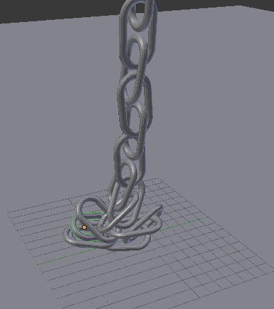
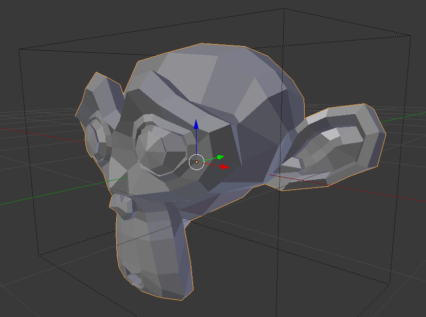
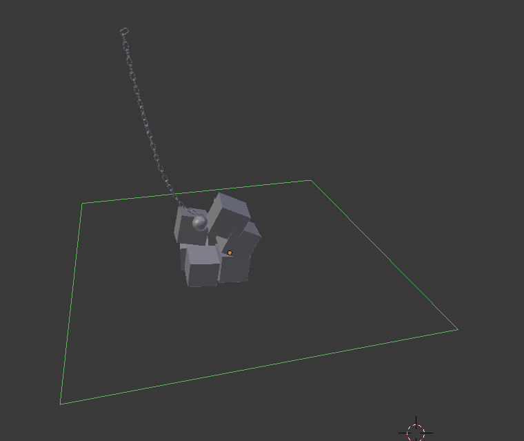
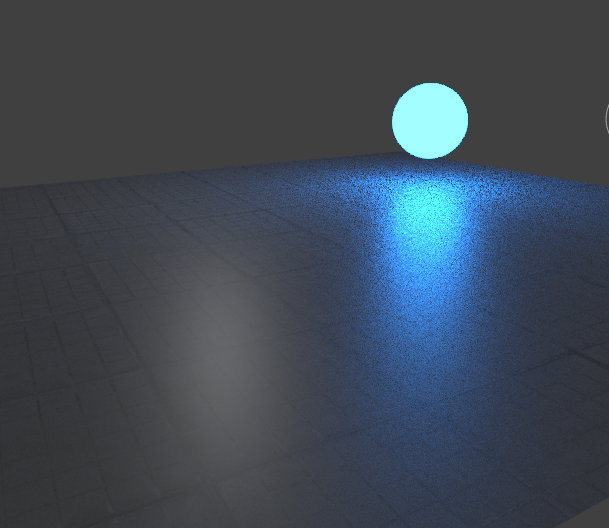

# Blender3d-Projects

To be a complete gamedeveloper it is suiteable to know how to model your own objects.
In this repo I will save different gameobject-models I create in blender3d.
Some of the objects below are very simple to create, but was hard to replicate
directly in some game-engines, therefore necessary.

# About this Repo
This Repo will work as a gallery and a place for me to drop newly created blender3d objects.
If I follow tutorials or use source material I will share links in folders.
Objects will be of various difficulty.

# How to use these objects in Unity3d
Just open the .blender files in unity3d editor. Might want to add colliders too.
I am also working with some of these objects and materials in the stronger Unreal Engine.

# Creation List
Below are all current accessable objects I prepared so far.

## Objects
### Chain 1
A simple chain, consisting of several objects.
I followed a tutorial on youtube.
Link to source in folder.

### Monkey 1
Just created the monkey-like primitive in blender.
With collider object.

### Torus 1
Just created torus primitive in blender.
With collider object.

## Simulations
### WreckingBall
Same tutorial as in chain 1. Here we complete the entire tutorial.
End result is a WreckingBall physic simulator.

## Materials
### Material 1
How to create good 3d materials, not just textures on objects.
Here i follow a tutorial and create a great material for unity.
This tutorial also show how to create bump maps for textures in photoshop.
This tutorial is not finished yet, i need photoshop to finish it.

### Material 2
Another "good" 3d material with bumps. Here I also follow a tutorial.
This Material is Cycle rendered and can be hard to bake for Unity.
Here we create a material from nodes in blender3d.

