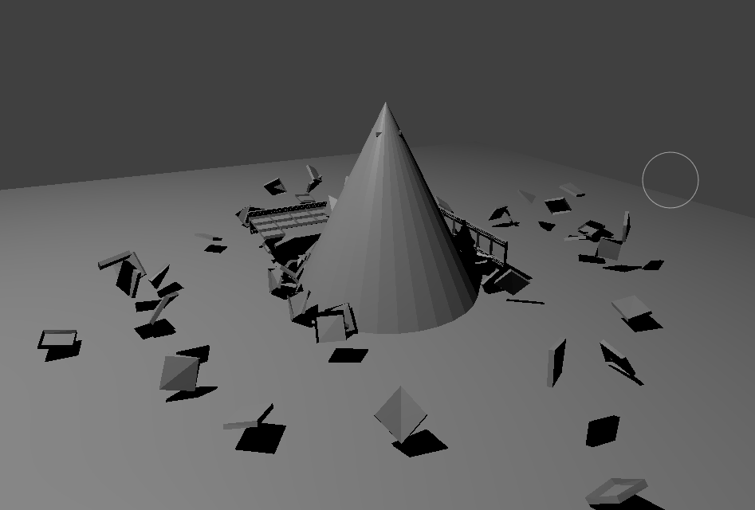
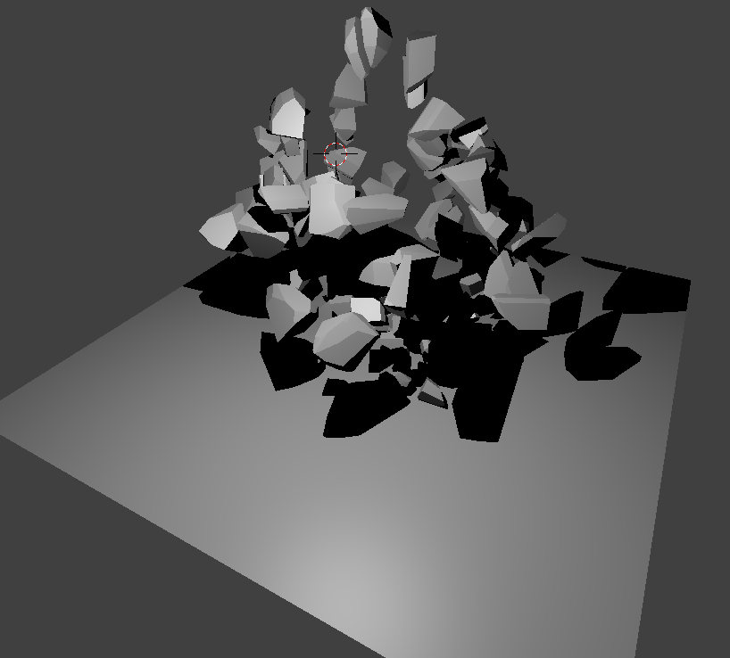
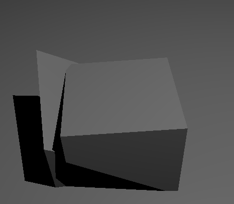
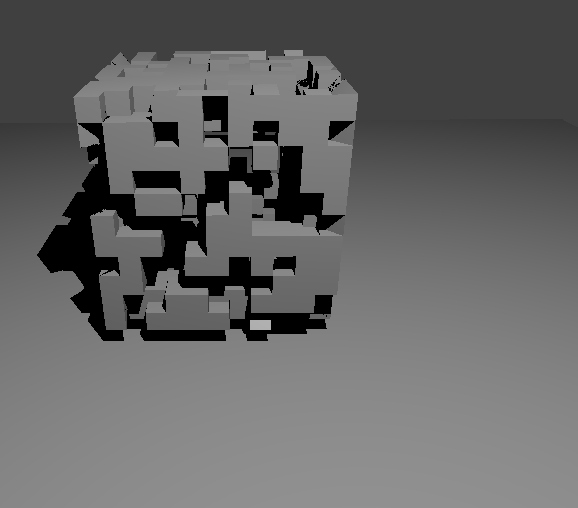
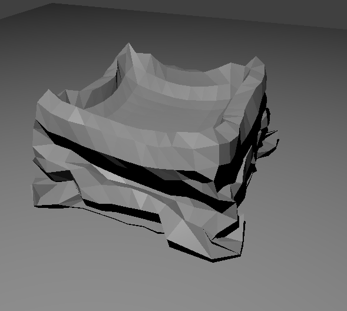
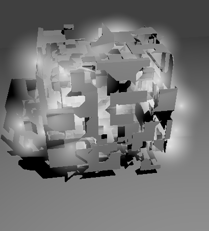
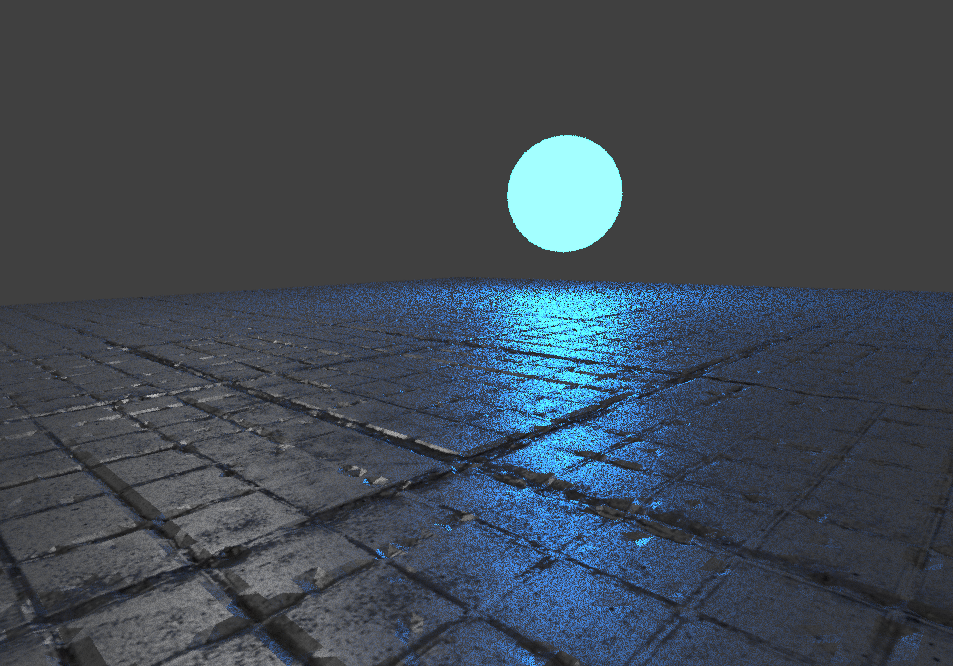

# Blender3d-Projects

To be a complete gamedeveloper it is suiteable to know how to model your own objects.
In this repo I will save different gameobjects and models I created in blender3d.
Some of the objects below are very simple to create, but was hard to replicate
directly in some game-engines, therefore necessary. Models will mainly be used for
3d printing and gamedevelopment.

# About this Repo
This Repo will work as a gallery and a place for me to drop newly created blender3d objects.
If I follow tutorials or use source material I will share links in folders with some comments.
Objects will be of various difficulty.

# How to use these objects in Unity3d
Just open the .blender files in unity3d editor. Might want to add colliders too.
I am also working with some of these objects and materials in Unreal Engine.

# Creation List
Below are all current accessable objects I prepared so far.

## Objects
### Chain 1
A simple chain, consisting of several objects.
I followed a tutorial on youtube.
Link to source in folder.

### Monkey 1
Just created the monkey-like primitive in blender.
With collider object.

### Torus 1
Just created torus primitive in blender.
With collider object. ( I needed this in unity )

### Towel 1
An cloth colliding towel, with easy material.
Followed a tutorial.

## Simulations
Here are some objects and physics I wanted to try out in blender.
Don't know of how much use they could be.

### WreckingBall
Same tutorial as in chain 1. Here we complete the entire tutorial.
End result is a WreckingBall physic simulator.

### SoftBodyDemolition
Watching video on youtube and trying to recreate collisions in blender3d.
In this example we use soft body collision on cube.

### CellFracture
Watching video on youtube and trying to recreate collisions in blender3d.
In this example we use rigidbody with cell fracture addon collision on a cube.
This effect can be edited with bullet constraint tools addon.

### BooleanModifier
Watching video on youtube and trying to recreate collisions in blender3d.
In this example we use boolean modifier.

### BuildModifier
Watching video on youtube and trying to recreate collisions in blender3d.
In this example we use build modifier.

### ClothSimulation
Watching video on youtube and trying to recreate collisions in blender3d.
In this example we use cloth simulation.

### ExplosionModifier
Watching video on youtube and trying to recreate collisions in blender3d.
In this example we use explosion modifier.

## Materials
In Unity3d we normaly use normal maps and height maps, to use blender materials
you will have to recreate them in unity. I recommed converting the textures in
the program CrazyBump, free to download, it generates all needed maps from a textures
 to create good materials.

### Material 1
How to create good 3d materials, not just textures on objects.
Here i follow a tutorial and create a great material in blender.
This tutorial also show how to create bump maps, reflection maps and displacement maps for textures in photoshop.

### Material 2
Another "good" 3d material with bumps. Here I also follow a tutorial.
This Material is Cycle rendered and can be hard to bake for Unity.
Here we create a material from nodes in blender3d.

